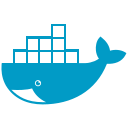

<h1 align="center">Hi 👋, I'm Ghassen Ayed  </h1>
<h3 align="center" style>Motivated Full Stack Developer && Able to quickly learn and maste new technologies</h3>

 

- 🌱 I’m currently learning <b>everything </b>.
- 👯 I’m looking to collaborate with other <b> content creators</b>
- 📫 How to reach me **ghassenayd@gmail.com**
 

### Languages and Tools:

 
 

:zap: GitHub Stats

 
<table width="100%">
<tr>
<td width="60%">

&nbsp;

</td>
<td width="40%">

</td>
</tr>
</table>

